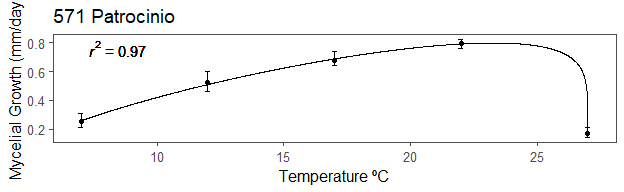

## 1. Intro

This Article describes the method and application of the Generalized Beta Function Inversion to model Mycelial growth rate of phoma isolates, used in Patricio et al. (2022).

The objective of this procedure is to model Mycelial Growth of different Phoma *species* with the given function.

Thorough analysis of the results is presented in Patricio et al (2022). This is an accompanion material with the inversion method used.

<div class="layout-chunk" data-layout="l-body">
<div class="sourceCode"><pre class="sourceCode r"><code class="sourceCode r"><span class='co'>#The current analysis was performed in R 3.6.0 (2019-04-26)</span>
<span class='co'>#Additional packages: tidyverse(1.2.1), xlsx(0.6.1), ggthemes(4.2.0)</span>


<span class='kw'><a href='https://rdrr.io/r/base/library.html'>library</a></span><span class='op'>(</span><span class='va'><a href='https://github.com/colearendt/xlsx'>xlsx</a></span><span class='op'>)</span> <span class='co'>#Loading library to read excel .xlsx files</span>
<span class='kw'><a href='https://rdrr.io/r/base/library.html'>library</a></span><span class='op'>(</span><span class='va'><a href='https://tidyverse.tidyverse.org'>tidyverse</a></span><span class='op'>)</span> <span class='co'>#tidyverse colletion of packages to handle data and plotting</span>
<span class='kw'><a href='https://rdrr.io/r/base/library.html'>library</a></span><span class='op'>(</span><span class='va'><a href='https://github.com/jrnold/ggthemes'>ggthemes</a></span><span class='op'>)</span> <span class='co'>#further plotting package with extra themes</span>

<span class='co'># Loading the data:</span>
<span class='va'>Base_phoma</span> <span class='op'>&lt;-</span> <span class='fu'><a href='https://rdrr.io/pkg/xlsx/man/read.xlsx.html'>read.xlsx</a></span><span class='op'>(</span><span class='st'>"data/Phoma_tarda_single_table_final.xlsx"</span>, sheetIndex <span class='op'>=</span> <span class='fl'>1</span>, encoding <span class='op'>=</span> <span class='st'>"UTF-8"</span><span class='op'>)</span>


<span class='co'>#Ensuring we are only reading the important columns </span>
<span class='co'>#and ignoring possible modifications in the excel file</span>
<span class='va'>Base_phoma</span> <span class='op'>&lt;-</span> <span class='va'>Base_phoma</span><span class='op'>[</span>,<span class='fu'><a href='https://rdrr.io/r/base/seq.html'>seq</a></span><span class='op'>(</span><span class='fl'>1</span>,<span class='fl'>4</span><span class='op'>)</span><span class='op'>]</span>
</code></pre></div>

</div>


### 1.2. Beta Generalized Function

The function is expressed as follows:

$$ f(T) = \beta_1*(T-\beta_2)^{\beta_4}*(\beta_3-T)^{\beta_5}$$
Where:

$\beta_1, \beta_4, \beta_5$ are adjustment parameters, and

$\beta_2, \beta_3$ are the minimum and maximum temperature.

#### Implementation in R

<div class="layout-chunk" data-layout="l-body">
<div class="sourceCode"><pre class="sourceCode r"><code class="sourceCode r"><span class='va'>gener_beta</span> <span class='op'>&lt;-</span> <span class='kw'>function</span><span class='op'>(</span><span class='va'>b1</span>,<span class='va'>b2</span>,<span class='va'>b3</span>,<span class='va'>b4</span>,<span class='va'>b5</span>, <span class='va'>x</span><span class='op'>)</span><span class='op'>{</span><span class='co'>#Calling the function</span>
  <span class='kw'><a href='https://rdrr.io/r/base/function.html'>return</a></span><span class='op'>(</span><span class='va'>b1</span><span class='op'>*</span><span class='op'>(</span><span class='va'>x</span><span class='op'>-</span><span class='va'>b2</span><span class='op'>)</span><span class='op'>^</span><span class='va'>b4</span><span class='op'>*</span><span class='op'>(</span><span class='va'>b3</span><span class='op'>-</span><span class='va'>x</span><span class='op'>)</span><span class='op'>^</span><span class='va'>b5</span><span class='op'>)</span>
<span class='op'>}</span> 
</code></pre></div>

</div>


## 2. Methods

The goal of this problem is to find the best set of parameters that fit the dataset of Temperature versus Mycelial growth.

A common approach to finding the best set of parameters is to optimize a Loss Function, in which the loss between the predicted values and the observed values is measured. The following Loss Function is the Mean Squared Error (MSE). In this project, the Mean Squared Error is divided by 2 to facilitate the derivation of the function:

$$L(f(T)) = \frac{MSE}{2} = \frac{1}{2}* \frac{\sum_{i=1}^{n}(y_i-f(T_i))^{2}}{n} $$
In which:  $L(f(T))$ is the Loss Function, $y$ is the observed value and $f(T)$ is the predicted value by the Generalized Beta Function. $n$ is the number of samples.

#### Implementation in R:

<div class="layout-chunk" data-layout="l-body">
<div class="sourceCode"><pre class="sourceCode r"><code class="sourceCode r"><span class='va'>loss_gener_beta</span> <span class='op'>&lt;-</span> <span class='kw'>function</span><span class='op'>(</span><span class='va'>b</span><span class='op'>)</span><span class='op'>{</span><span class='co'>#Loss Function for the data and optimization algorithm</span>
  <span class='co'>#Inside this function I am already calling the dataframe with the data,</span>
  <span class='co'>#To apply it to different datasets one needs to slightly modify this.</span>
  <span class='va'>b1</span> <span class='op'>&lt;-</span> <span class='va'>b</span><span class='op'>[</span><span class='fl'>1</span><span class='op'>]</span>
  <span class='va'>b2</span><span class='op'>&lt;-</span><span class='va'>b</span><span class='op'>[</span><span class='fl'>2</span><span class='op'>]</span>
  <span class='va'>b3</span><span class='op'>&lt;-</span><span class='va'>b</span><span class='op'>[</span><span class='fl'>3</span><span class='op'>]</span>
  <span class='va'>b4</span><span class='op'>&lt;-</span><span class='va'>b</span><span class='op'>[</span><span class='fl'>4</span><span class='op'>]</span>
  <span class='va'>b5</span><span class='op'>&lt;-</span><span class='va'>b</span><span class='op'>[</span><span class='fl'>5</span><span class='op'>]</span>
  <span class='op'>(</span><span class='fl'>1</span><span class='op'>/</span><span class='fl'>2</span><span class='op'>)</span><span class='op'>*</span><span class='op'>(</span><span class='fu'><a href='https://rdrr.io/r/base/sum.html'>sum</a></span><span class='op'>(</span><span class='op'>(</span><span class='va'>base_teste</span><span class='op'>$</span><span class='va'>Mycelial_Growth_mm_day</span><span class='op'>-</span><span class='fu'>gener_beta</span><span class='op'>(</span><span class='va'>b1</span>,<span class='va'>b2</span>,<span class='va'>b3</span>,<span class='va'>b4</span>,<span class='va'>b5</span>,<span class='va'>base_teste</span><span class='op'>$</span><span class='va'>Temperature_C</span><span class='op'>)</span><span class='op'>)</span><span class='op'>^</span><span class='fl'>2</span><span class='op'>)</span><span class='op'>)</span><span class='op'>*</span>
    <span class='op'>(</span><span class='fl'>1</span><span class='op'>/</span><span class='fu'><a href='https://rdrr.io/r/base/dim.html'>dim</a></span><span class='op'>(</span><span class='va'>base_teste</span><span class='op'>)</span><span class='op'>[</span><span class='fl'>1</span><span class='op'>]</span><span class='op'>)</span>
<span class='op'>}</span>
</code></pre></div>

</div>


The best set of parameters is the one that minimizes the Loss Function. In nonlinear models, such as the current function, the best model must generally be fit with numerical optimizers. And these optimizers often use gradient search to find global or local minima for the loss function.

Since this function is differentiable, we can precisely compute its gradient. Therefore, besides calculating the Loss Function, we calculate its gradient to the parameters.
Alternatively, algorithms include a numerical gradient calculation. By calculating the gradient directly, we avoid numerical errors, that might occur in this step.

The gradient of the Loss Function is defined as:

$$ \nabla L = \begin{bmatrix}
  \frac{\partial{L}}{\partial \beta_1} \\
  \frac{\partial{L}}{\partial \beta_2} \\
  \frac{\partial{L}}{\partial \beta_3} \\
  \frac{\partial{L}}{\partial \beta_4} \\
  \frac{\partial{L}}{\partial \beta_5} \\
  \end{bmatrix} = \begin{bmatrix}
  \sum_{i=1}^{n}(-1)*(y_i-f(T_i))*(T_i-\beta_2)^{\beta_4}*(\beta_3-T_i)^{\beta_5}/n \\
  \sum_{i=1}^{n}(-1)*(y_i-f(T_i))*\beta_1*\beta_4*(-1)*(T_i-\beta_2)^{\beta_4-1}*(\beta_3-T_i)^{\beta_5}/n \\
  \sum_{i=1}^{n}(-1)*(y_i-f(T_i))*\beta_1*\beta_5*(T_i-\beta_2)^{\beta_4}*(\beta_3-T_i)^{\beta_5-1}/n \\
  \sum_{i=1}^{n}(-1)*(y_i-f(T_i))*\beta_1*(T_i-\beta_2)^{\beta_4}*(\beta_3-T_i)^{\beta_5}*\ln{(T_i-\beta_2)}/n \\
  \sum_{i=1}^{n}(-1)*(y_i-f(T_i))*\beta_1*(T_i-\beta_2)^{\beta_4}*(\beta_3-T_i)^{\beta_5}*\ln (\beta_3-T_i)/n \\
  \end{bmatrix}$$
  
#### Implementation of the gradient function in R

<div class="layout-chunk" data-layout="l-body">
<div class="sourceCode"><pre class="sourceCode r"><code class="sourceCode r"><span class='va'>gradient_loss_beta</span> <span class='op'>&lt;-</span> <span class='kw'>function</span><span class='op'>(</span><span class='va'>b</span><span class='op'>)</span><span class='op'>{</span>
  <span class='co'>#Here I'm calculating the gradients as an input for the optimization algorithmn</span>
  <span class='co'>#Again, I'm already calling the dataframe I'm using for optimizing</span>
  <span class='va'>t</span> <span class='op'>=</span> <span class='va'>base_teste</span><span class='op'>$</span><span class='va'>Temperature_C</span>
  <span class='va'>y</span> <span class='op'>=</span> <span class='va'>base_teste</span><span class='op'>$</span><span class='va'>Mycelial_Growth_mm_day</span>
  <span class='va'>del_1</span> <span class='op'>=</span> <span class='fu'><a href='https://rdrr.io/r/base/sum.html'>sum</a></span><span class='op'>(</span><span class='op'>(</span><span class='op'>-</span><span class='fl'>1</span><span class='op'>)</span><span class='op'>*</span><span class='op'>(</span><span class='va'>y</span><span class='op'>-</span><span class='fu'>gener_beta</span><span class='op'>(</span><span class='va'>b</span><span class='op'>[</span><span class='fl'>1</span><span class='op'>]</span>,<span class='va'>b</span><span class='op'>[</span><span class='fl'>2</span><span class='op'>]</span>,<span class='va'>b</span><span class='op'>[</span><span class='fl'>3</span><span class='op'>]</span>,<span class='va'>b</span><span class='op'>[</span><span class='fl'>4</span><span class='op'>]</span>,<span class='va'>b</span><span class='op'>[</span><span class='fl'>5</span><span class='op'>]</span>, <span class='va'>t</span><span class='op'>)</span><span class='op'>)</span><span class='op'>*</span>
                <span class='op'>(</span><span class='va'>t</span><span class='op'>-</span><span class='va'>b</span><span class='op'>[</span><span class='fl'>2</span><span class='op'>]</span><span class='op'>)</span><span class='op'>^</span><span class='va'>b</span><span class='op'>[</span><span class='fl'>4</span><span class='op'>]</span><span class='op'>*</span><span class='op'>(</span><span class='va'>b</span><span class='op'>[</span><span class='fl'>3</span><span class='op'>]</span><span class='op'>-</span><span class='va'>t</span><span class='op'>)</span><span class='op'>^</span><span class='va'>b</span><span class='op'>[</span><span class='fl'>5</span><span class='op'>]</span><span class='op'>)</span>
  <span class='va'>del_2</span> <span class='op'>=</span> <span class='fu'><a href='https://rdrr.io/r/base/sum.html'>sum</a></span><span class='op'>(</span><span class='op'>(</span><span class='op'>-</span><span class='fl'>1</span><span class='op'>)</span><span class='op'>*</span><span class='op'>(</span><span class='va'>y</span><span class='op'>-</span><span class='fu'>gener_beta</span><span class='op'>(</span><span class='va'>b</span><span class='op'>[</span><span class='fl'>1</span><span class='op'>]</span>,<span class='va'>b</span><span class='op'>[</span><span class='fl'>2</span><span class='op'>]</span>,<span class='va'>b</span><span class='op'>[</span><span class='fl'>3</span><span class='op'>]</span>,<span class='va'>b</span><span class='op'>[</span><span class='fl'>4</span><span class='op'>]</span>,<span class='va'>b</span><span class='op'>[</span><span class='fl'>5</span><span class='op'>]</span>, <span class='va'>t</span><span class='op'>)</span><span class='op'>)</span><span class='op'>*</span><span class='va'>b</span><span class='op'>[</span><span class='fl'>1</span><span class='op'>]</span><span class='op'>*</span><span class='va'>b</span><span class='op'>[</span><span class='fl'>4</span><span class='op'>]</span><span class='op'>*</span>
                <span class='op'>(</span><span class='op'>-</span><span class='fl'>1</span><span class='op'>)</span><span class='op'>*</span><span class='op'>(</span><span class='va'>t</span><span class='op'>-</span><span class='va'>b</span><span class='op'>[</span><span class='fl'>2</span><span class='op'>]</span><span class='op'>)</span><span class='op'>^</span><span class='op'>(</span><span class='va'>b</span><span class='op'>[</span><span class='fl'>4</span><span class='op'>]</span><span class='op'>-</span><span class='fl'>1</span><span class='op'>)</span><span class='op'>*</span><span class='op'>(</span><span class='va'>b</span><span class='op'>[</span><span class='fl'>3</span><span class='op'>]</span><span class='op'>-</span><span class='va'>t</span><span class='op'>)</span><span class='op'>^</span><span class='va'>b</span><span class='op'>[</span><span class='fl'>5</span><span class='op'>]</span><span class='op'>)</span>
  <span class='va'>del_3</span> <span class='op'>=</span> <span class='fu'><a href='https://rdrr.io/r/base/sum.html'>sum</a></span><span class='op'>(</span><span class='op'>(</span><span class='op'>-</span><span class='fl'>1</span><span class='op'>)</span><span class='op'>*</span><span class='op'>(</span><span class='va'>y</span><span class='op'>-</span><span class='fu'>gener_beta</span><span class='op'>(</span><span class='va'>b</span><span class='op'>[</span><span class='fl'>1</span><span class='op'>]</span>,<span class='va'>b</span><span class='op'>[</span><span class='fl'>2</span><span class='op'>]</span>,<span class='va'>b</span><span class='op'>[</span><span class='fl'>3</span><span class='op'>]</span>,<span class='va'>b</span><span class='op'>[</span><span class='fl'>4</span><span class='op'>]</span>,<span class='va'>b</span><span class='op'>[</span><span class='fl'>5</span><span class='op'>]</span>, <span class='va'>t</span><span class='op'>)</span><span class='op'>)</span><span class='op'>*</span><span class='va'>b</span><span class='op'>[</span><span class='fl'>1</span><span class='op'>]</span><span class='op'>*</span><span class='va'>b</span><span class='op'>[</span><span class='fl'>5</span><span class='op'>]</span><span class='op'>*</span>
                <span class='op'>(</span><span class='va'>t</span><span class='op'>-</span><span class='va'>b</span><span class='op'>[</span><span class='fl'>2</span><span class='op'>]</span><span class='op'>)</span><span class='op'>^</span><span class='va'>b</span><span class='op'>[</span><span class='fl'>4</span><span class='op'>]</span><span class='op'>*</span><span class='op'>(</span><span class='va'>b</span><span class='op'>[</span><span class='fl'>3</span><span class='op'>]</span><span class='op'>-</span><span class='va'>t</span><span class='op'>)</span><span class='op'>^</span><span class='op'>(</span><span class='va'>b</span><span class='op'>[</span><span class='fl'>5</span><span class='op'>]</span><span class='op'>-</span><span class='fl'>1</span><span class='op'>)</span><span class='op'>)</span>
  <span class='va'>del_4</span> <span class='op'>=</span> <span class='fu'><a href='https://rdrr.io/r/base/sum.html'>sum</a></span><span class='op'>(</span><span class='op'>(</span><span class='op'>-</span><span class='fl'>1</span><span class='op'>)</span><span class='op'>*</span><span class='op'>(</span><span class='va'>y</span><span class='op'>-</span><span class='fu'>gener_beta</span><span class='op'>(</span><span class='va'>b</span><span class='op'>[</span><span class='fl'>1</span><span class='op'>]</span>,<span class='va'>b</span><span class='op'>[</span><span class='fl'>2</span><span class='op'>]</span>,<span class='va'>b</span><span class='op'>[</span><span class='fl'>3</span><span class='op'>]</span>,<span class='va'>b</span><span class='op'>[</span><span class='fl'>4</span><span class='op'>]</span>,<span class='va'>b</span><span class='op'>[</span><span class='fl'>5</span><span class='op'>]</span>, <span class='va'>t</span><span class='op'>)</span><span class='op'>)</span><span class='op'>*</span><span class='va'>b</span><span class='op'>[</span><span class='fl'>1</span><span class='op'>]</span><span class='op'>*</span><span class='op'>(</span><span class='va'>b</span><span class='op'>[</span><span class='fl'>3</span><span class='op'>]</span><span class='op'>-</span><span class='va'>t</span><span class='op'>)</span><span class='op'>^</span><span class='va'>b</span><span class='op'>[</span><span class='fl'>5</span><span class='op'>]</span><span class='op'>*</span>
                <span class='op'>(</span><span class='va'>t</span><span class='op'>-</span><span class='va'>b</span><span class='op'>[</span><span class='fl'>2</span><span class='op'>]</span><span class='op'>)</span><span class='op'>^</span><span class='va'>b</span><span class='op'>[</span><span class='fl'>4</span><span class='op'>]</span><span class='op'>*</span><span class='fu'><a href='https://rdrr.io/r/base/Log.html'>log</a></span><span class='op'>(</span><span class='va'>t</span><span class='op'>-</span><span class='va'>b</span><span class='op'>[</span><span class='fl'>2</span><span class='op'>]</span><span class='op'>)</span><span class='op'>)</span>
  <span class='va'>del_5</span> <span class='op'>=</span> <span class='fu'><a href='https://rdrr.io/r/base/sum.html'>sum</a></span><span class='op'>(</span><span class='op'>(</span><span class='op'>-</span><span class='fl'>1</span><span class='op'>)</span><span class='op'>*</span><span class='op'>(</span><span class='va'>y</span><span class='op'>-</span><span class='fu'>gener_beta</span><span class='op'>(</span><span class='va'>b</span><span class='op'>[</span><span class='fl'>1</span><span class='op'>]</span>,<span class='va'>b</span><span class='op'>[</span><span class='fl'>2</span><span class='op'>]</span>,<span class='va'>b</span><span class='op'>[</span><span class='fl'>3</span><span class='op'>]</span>,<span class='va'>b</span><span class='op'>[</span><span class='fl'>4</span><span class='op'>]</span>,<span class='va'>b</span><span class='op'>[</span><span class='fl'>5</span><span class='op'>]</span>, <span class='va'>t</span><span class='op'>)</span><span class='op'>)</span><span class='op'>*</span><span class='va'>b</span><span class='op'>[</span><span class='fl'>1</span><span class='op'>]</span><span class='op'>*</span>
                <span class='op'>(</span><span class='va'>t</span><span class='op'>-</span><span class='va'>b</span><span class='op'>[</span><span class='fl'>2</span><span class='op'>]</span><span class='op'>)</span><span class='op'>^</span><span class='va'>b</span><span class='op'>[</span><span class='fl'>4</span><span class='op'>]</span><span class='op'>*</span><span class='op'>(</span><span class='va'>b</span><span class='op'>[</span><span class='fl'>3</span><span class='op'>]</span><span class='op'>-</span><span class='va'>t</span><span class='op'>)</span><span class='op'>^</span><span class='va'>b</span><span class='op'>[</span><span class='fl'>5</span><span class='op'>]</span><span class='op'>*</span><span class='fu'><a href='https://rdrr.io/r/base/Log.html'>log</a></span><span class='op'>(</span><span class='va'>b</span><span class='op'>[</span><span class='fl'>3</span><span class='op'>]</span><span class='op'>-</span><span class='va'>t</span><span class='op'>)</span><span class='op'>)</span>
  <span class='kw'><a href='https://rdrr.io/r/base/function.html'>return</a></span><span class='op'>(</span><span class='op'>(</span><span class='fu'><a href='https://rdrr.io/r/base/c.html'>c</a></span><span class='op'>(</span><span class='va'>del_1</span>,<span class='va'>del_2</span>,<span class='va'>del_3</span>,<span class='va'>del_4</span>,<span class='va'>del_5</span><span class='op'>)</span><span class='op'>/</span>
            <span class='fu'><a href='https://rdrr.io/r/base/dim.html'>dim</a></span><span class='op'>(</span><span class='va'>base_teste</span><span class='op'>)</span><span class='op'>[</span><span class='fl'>1</span><span class='op'>]</span><span class='op'>)</span><span class='op'>)</span>
<span class='op'>}</span>
</code></pre></div>

</div>


### 2.1. Optimization

The above functions were implemented in R (R 2019) and the optimization was carried on with the R-function ConstrOptim (Lange, 2001), which performs Constrained Optimization. The numerical algorithm deployed was Broyden-Fletcher-Goldfarb-Shanno (BFGS) simultaneously published by those authors in 1970.

Since optimization in nonlinear models might find non-desirable local minima or the algorithm might search out-of-bounds values, optimization was carried on with constraints. The ConstrOptim function in R allows for constraints deployed in a linear system: u_i∙ θ≥ c_i where θ is the parameter vector and u_i,c_i are the linear system’s values in matrix/vector format. To correctly optimize the loss function, the parameter constraints β_1,β_4,β_5> 0 and  β_2,<7,β_3>27 must be supplied. This is computed through the following linear system:

$$\begin{bmatrix}
1 & 0 & 0 & 0 & 0 \\
0 & -1 & 0 & 0 & 0 \\
0 & 0 & 1 & 0 & 0 \\
0 & 0 & 0 & 1 & 0 \\
0 & 0 & 0 & 0 & 1 \\
\end{bmatrix} * \begin{bmatrix}
\beta_1 \\
\beta_2 \\
\beta_3 \\
\beta_4 \\ 
\beta_5 \\
\end{bmatrix} > \begin{bmatrix}
0 \\
-7 \\
27 \\
0 \\
0 \\
\end{bmatrix}$$

#### Inversion routine implementation in R

The optimization is carried by a ```for``` loop that loops through the names of all isolates and apply the  inversion with ```constrOptim``` to find the parameters for each isolate. Finally it calculates the goodness of fit statistics (R^2 and F) and saves the results to a dataframe.

<div class="layout-chunk" data-layout="l-body">
<div class="sourceCode"><pre class="sourceCode r"><code class="sourceCode r"><span class='va'>isolados</span> <span class='op'>&lt;-</span> <span class='va'>Base_phoma</span><span class='op'><a href='https://magrittr.tidyverse.org/reference/pipe.html'>%&gt;%</a></span> <span class='co'>#Pulling all isolates from the dataset:</span>
  <span class='fu'><a href='https://dplyr.tidyverse.org/reference/select.html'>select</a></span><span class='op'>(</span><span class='va'>Isolate</span><span class='op'>)</span><span class='op'><a href='https://magrittr.tidyverse.org/reference/pipe.html'>%&gt;%</a></span>
  <span class='fu'><a href='https://dplyr.tidyverse.org/reference/pull.html'>pull</a></span><span class='op'>(</span><span class='va'>.</span><span class='op'>)</span><span class='op'><a href='https://magrittr.tidyverse.org/reference/pipe.html'>%&gt;%</a></span>
  <span class='fu'><a href='https://rdrr.io/r/base/factor.html'>factor</a></span><span class='op'>(</span><span class='va'>.</span><span class='op'>)</span><span class='op'><a href='https://magrittr.tidyverse.org/reference/pipe.html'>%&gt;%</a></span>
  <span class='fu'><a href='https://rdrr.io/r/base/levels.html'>levels</a></span><span class='op'>(</span><span class='va'>.</span><span class='op'>)</span>

<span class='va'>params</span> <span class='op'>&lt;-</span> <span class='fu'><a href='https://rdrr.io/r/base/data.frame.html'>data.frame</a></span><span class='op'>(</span>Isolate <span class='op'>=</span> <span class='fu'><a href='https://rdrr.io/r/base/c.html'>c</a></span><span class='op'>(</span><span class='op'>)</span>, par <span class='op'>=</span> <span class='fu'><a href='https://rdrr.io/r/base/c.html'>c</a></span><span class='op'>(</span><span class='op'>)</span>, mse <span class='op'>=</span> <span class='fu'><a href='https://rdrr.io/r/base/c.html'>c</a></span><span class='op'>(</span><span class='op'>)</span>,
                     convergence <span class='op'>=</span> <span class='fu'><a href='https://rdrr.io/r/base/c.html'>c</a></span><span class='op'>(</span><span class='op'>)</span>, b1 <span class='op'>=</span> <span class='fu'><a href='https://rdrr.io/r/base/c.html'>c</a></span><span class='op'>(</span><span class='op'>)</span>, b2 <span class='op'>=</span> <span class='fu'><a href='https://rdrr.io/r/base/c.html'>c</a></span><span class='op'>(</span><span class='op'>)</span>,
                     b3 <span class='op'>=</span> <span class='fu'><a href='https://rdrr.io/r/base/c.html'>c</a></span><span class='op'>(</span><span class='op'>)</span>, b4 <span class='op'>=</span> <span class='fu'><a href='https://rdrr.io/r/base/c.html'>c</a></span><span class='op'>(</span><span class='op'>)</span>, b5 <span class='op'>=</span> <span class='fu'><a href='https://rdrr.io/r/base/c.html'>c</a></span><span class='op'>(</span><span class='op'>)</span>, R_2 <span class='op'>=</span> <span class='fu'><a href='https://rdrr.io/r/base/c.html'>c</a></span><span class='op'>(</span><span class='op'>)</span>,
                     method <span class='op'>=</span> <span class='fu'><a href='https://rdrr.io/r/base/c.html'>c</a></span><span class='op'>(</span><span class='op'>)</span>, F_test <span class='op'>=</span> <span class='fu'><a href='https://rdrr.io/r/base/c.html'>c</a></span><span class='op'>(</span><span class='op'>)</span><span class='op'>)</span>
<span class='va'>j</span> <span class='op'>=</span> <span class='fl'>1</span><span class='co'>#Declaring an empty dataframe to input the results</span>
<span class='kw'>for</span> <span class='op'>(</span><span class='va'>i</span> <span class='kw'>in</span> <span class='va'>isolados</span><span class='op'>)</span><span class='op'>{</span>
  <span class='va'>Base_phoma</span><span class='op'><a href='https://magrittr.tidyverse.org/reference/pipe.html'>%&gt;%</a></span>
    <span class='fu'><a href='https://dplyr.tidyverse.org/reference/filter.html'>filter</a></span><span class='op'>(</span><span class='op'>!</span><span class='fu'><a href='https://rdrr.io/r/base/NA.html'>is.na</a></span><span class='op'>(</span><span class='va'>Mycelial_Growth_mm_day</span><span class='op'>)</span><span class='op'>)</span><span class='op'><a href='https://magrittr.tidyverse.org/reference/pipe.html'>%&gt;%</a></span>
    <span class='fu'><a href='https://dplyr.tidyverse.org/reference/filter.html'>filter</a></span><span class='op'>(</span><span class='va'>Isolate</span> <span class='op'>==</span> <span class='va'>i</span><span class='op'>)</span><span class='op'>-&gt;</span> <span class='va'>base_teste</span> <span class='co'>#Pulling the dataframe for each isolate</span>

  <span class='va'>p</span> <span class='op'>&lt;-</span> <span class='fu'><a href='https://rdrr.io/r/stats/constrOptim.html'>constrOptim</a></span><span class='op'>(</span><span class='fu'><a href='https://rdrr.io/r/base/c.html'>c</a></span><span class='op'>(</span><span class='fl'>0.3</span>,<span class='fl'>5</span>,<span class='fl'>30</span>,<span class='fl'>0.7</span>,<span class='fl'>0.7</span><span class='op'>)</span>, 
                   f <span class='op'>=</span> <span class='va'>loss_gener_beta</span>, 
                   grad <span class='op'>=</span> <span class='va'>gradient_loss_beta</span>, 
                   ui <span class='op'>=</span><span class='fu'><a href='https://rdrr.io/r/base/cbind.html'>rbind</a></span><span class='op'>(</span><span class='fu'><a href='https://rdrr.io/r/base/c.html'>c</a></span><span class='op'>(</span><span class='fl'>1</span>,<span class='fl'>0</span>,<span class='fl'>0</span>,<span class='fl'>0</span>,<span class='fl'>0</span><span class='op'>)</span>,
                             <span class='fu'><a href='https://rdrr.io/r/base/c.html'>c</a></span><span class='op'>(</span><span class='fl'>0</span>,<span class='op'>-</span><span class='fl'>1</span>,<span class='fl'>0</span>,<span class='fl'>0</span>,<span class='fl'>0</span><span class='op'>)</span>,
                             <span class='fu'><a href='https://rdrr.io/r/base/c.html'>c</a></span><span class='op'>(</span><span class='fl'>0</span>,<span class='fl'>0</span>,<span class='fl'>1</span>,<span class='fl'>0</span>,<span class='fl'>0</span><span class='op'>)</span>,
                             <span class='fu'><a href='https://rdrr.io/r/base/c.html'>c</a></span><span class='op'>(</span><span class='fl'>0</span>,<span class='fl'>0</span>,<span class='fl'>0</span>,<span class='fl'>1</span>,<span class='fl'>0</span><span class='op'>)</span>
                             ,<span class='fu'><a href='https://rdrr.io/r/base/c.html'>c</a></span><span class='op'>(</span><span class='fl'>0</span>,<span class='fl'>0</span>,<span class='fl'>0</span>,<span class='fl'>0</span>,<span class='fl'>1</span><span class='op'>)</span><span class='op'>)</span>,
                  ci <span class='op'>=</span> <span class='fu'><a href='https://rdrr.io/r/base/c.html'>c</a></span><span class='op'>(</span><span class='fl'>0</span>,<span class='op'>-</span><span class='fl'>7</span>,<span class='fl'>27</span>,<span class='fl'>0</span>,<span class='fl'>0</span><span class='op'>)</span><span class='op'>)</span> <span class='co'>#Performing the Constrained Opimizer for each isolate.</span>
  
  <span class='co'>#Calculating the results of the optmized function for goodness of fit measurement:</span>
  <span class='va'>base_teste</span><span class='op'><a href='https://magrittr.tidyverse.org/reference/pipe.html'>%&gt;%</a></span>
    <span class='fu'><a href='https://dplyr.tidyverse.org/reference/mutate.html'>mutate</a></span><span class='op'>(</span>beta <span class='op'>=</span> <span class='fu'>gener_beta</span><span class='op'>(</span><span class='va'>p</span><span class='op'>$</span><span class='va'>par</span><span class='op'>[</span><span class='fl'>1</span><span class='op'>]</span>,<span class='va'>p</span><span class='op'>$</span><span class='va'>par</span><span class='op'>[</span><span class='fl'>2</span><span class='op'>]</span>,<span class='va'>p</span><span class='op'>$</span><span class='va'>par</span><span class='op'>[</span><span class='fl'>3</span><span class='op'>]</span>,<span class='va'>p</span><span class='op'>$</span><span class='va'>par</span><span class='op'>[</span><span class='fl'>4</span><span class='op'>]</span>,<span class='va'>p</span><span class='op'>$</span><span class='va'>par</span><span class='op'>[</span><span class='fl'>5</span><span class='op'>]</span>, <span class='va'>Temperature_C</span><span class='op'>)</span><span class='op'>)</span><span class='op'><a href='https://magrittr.tidyverse.org/reference/pipe.html'>%&gt;%</a></span>
    <span class='fu'><a href='https://dplyr.tidyverse.org/reference/select.html'>select</a></span><span class='op'>(</span><span class='va'>beta</span><span class='op'>)</span><span class='op'><a href='https://magrittr.tidyverse.org/reference/pipe.html'>%&gt;%</a></span>
    <span class='fu'><a href='https://dplyr.tidyverse.org/reference/pull.html'>pull</a></span><span class='op'>(</span><span class='va'>.</span><span class='op'>)</span><span class='op'>-&gt;</span> <span class='va'>x</span>
  
  <span class='va'>method</span> <span class='op'>=</span> <span class='st'>"BFGS"</span>
  <span class='co'>#Adding the results to each row</span>
  <span class='va'>params</span><span class='op'>[</span><span class='va'>j</span>,<span class='st'>"Isolate"</span><span class='op'>]</span> <span class='op'>=</span> <span class='va'>i</span>
  <span class='va'>params</span><span class='op'>[</span><span class='va'>j</span>,<span class='st'>"mse"</span><span class='op'>]</span> <span class='op'>=</span> <span class='va'>p</span><span class='op'>$</span><span class='va'>value</span><span class='op'>*</span><span class='fl'>2</span> <span class='co'>#Since we are optimizing on half of the MSE, here I'm multiplying by 2</span>
  <span class='va'>params</span><span class='op'>[</span><span class='va'>j</span>,<span class='st'>"convergence"</span><span class='op'>]</span> <span class='op'>=</span> <span class='va'>p</span><span class='op'>$</span><span class='va'>convergence</span> <span class='co'>#Checking if the algorithmn converged. 0 means ok.</span>
  <span class='va'>params</span><span class='op'>[</span><span class='va'>j</span>,<span class='st'>"b1"</span><span class='op'>]</span> <span class='op'>=</span> <span class='va'>p</span><span class='op'>$</span><span class='va'>par</span><span class='op'>[</span><span class='fl'>1</span><span class='op'>]</span>
  <span class='va'>params</span><span class='op'>[</span><span class='va'>j</span>,<span class='st'>"b2"</span><span class='op'>]</span> <span class='op'>=</span> <span class='va'>p</span><span class='op'>$</span><span class='va'>par</span><span class='op'>[</span><span class='fl'>2</span><span class='op'>]</span>
  <span class='va'>params</span><span class='op'>[</span><span class='va'>j</span>,<span class='st'>"b3"</span><span class='op'>]</span> <span class='op'>=</span> <span class='va'>p</span><span class='op'>$</span><span class='va'>par</span><span class='op'>[</span><span class='fl'>3</span><span class='op'>]</span>
  <span class='va'>params</span><span class='op'>[</span><span class='va'>j</span>,<span class='st'>"b4"</span><span class='op'>]</span> <span class='op'>=</span> <span class='va'>p</span><span class='op'>$</span><span class='va'>par</span><span class='op'>[</span><span class='fl'>4</span><span class='op'>]</span>
  <span class='va'>params</span><span class='op'>[</span><span class='va'>j</span>,<span class='st'>"b5"</span><span class='op'>]</span> <span class='op'>=</span> <span class='va'>p</span><span class='op'>$</span><span class='va'>par</span><span class='op'>[</span><span class='fl'>5</span><span class='op'>]</span>
  <span class='va'>params</span><span class='op'>[</span><span class='va'>j</span>,<span class='st'>"R_2"</span><span class='op'>]</span> <span class='op'>=</span> <span class='fu'><a href='https://rdrr.io/r/stats/cor.html'>cor</a></span><span class='op'>(</span><span class='va'>x</span>, <span class='va'>base_teste</span><span class='op'>$</span><span class='va'>Mycelial_Growth_mm_day</span><span class='op'>)</span><span class='op'>^</span><span class='fl'>2</span>
  <span class='va'>params</span><span class='op'>[</span><span class='va'>j</span>, <span class='st'>"F_test"</span><span class='op'>]</span> <span class='op'>=</span> <span class='op'>(</span><span class='fu'><a href='https://rdrr.io/r/base/nrow.html'>nrow</a></span><span class='op'>(</span><span class='va'>base_teste</span><span class='op'>)</span><span class='op'>-</span><span class='fl'>2</span><span class='op'>)</span><span class='op'>*</span><span class='va'>params</span><span class='op'>[</span><span class='va'>j</span>, <span class='st'>"R_2"</span><span class='op'>]</span><span class='op'>/</span><span class='op'>(</span><span class='fl'>1</span><span class='op'>-</span><span class='va'>params</span><span class='op'>[</span><span class='va'>j</span>, <span class='st'>"R_2"</span><span class='op'>]</span><span class='op'>)</span>
  <span class='va'>params</span><span class='op'>[</span><span class='va'>j</span>,<span class='st'>"method"</span><span class='op'>]</span> <span class='op'>=</span> <span class='va'>method</span>
  <span class='va'>j</span> <span class='op'>=</span> <span class='va'>j</span><span class='op'>+</span><span class='fl'>1</span>
  <span class='co'>#print(p)</span>
  <span class='op'>}</span>
<span class='va'>params</span> <span class='op'>&lt;-</span> <span class='va'>params</span> <span class='op'><a href='https://magrittr.tidyverse.org/reference/pipe.html'>%&gt;%</a></span>
  <span class='fu'><a href='https://dplyr.tidyverse.org/reference/mutate.html'>mutate</a></span><span class='op'>(</span>maxim <span class='op'>=</span> <span class='op'>(</span><span class='va'>b2</span><span class='op'>*</span><span class='va'>b5</span><span class='op'>+</span><span class='va'>b3</span><span class='op'>*</span><span class='va'>b4</span><span class='op'>)</span><span class='op'>/</span><span class='op'>(</span><span class='va'>b4</span><span class='op'>+</span><span class='va'>b5</span><span class='op'>)</span><span class='op'>)</span> <span class='co'>#Calculating the max temperature by maximizing the function (setting the derivative = 0)</span>
</code></pre></div>

</div>


## 3. Results

<div class="layout-chunk" data-layout="l-body">
<table class="table table-striped table-hover table-condensed table-responsive" style="font-size: 11px; margin-left: auto; margin-right: auto;">
 <thead>
  <tr>
   <th style="text-align:left;"> Isolate </th>
   <th style="text-align:left;"> mse </th>
   <th style="text-align:left;"> convergence </th>
   <th style="text-align:left;"> b1 </th>
   <th style="text-align:left;"> b2 </th>
   <th style="text-align:left;"> b3 </th>
   <th style="text-align:left;"> b4 </th>
   <th style="text-align:left;"> b5 </th>
   <th style="text-align:left;"> R_2 </th>
   <th style="text-align:left;"> F_test </th>
   <th style="text-align:left;"> method </th>
   <th style="text-align:left;"> maxim </th>
  </tr>
 </thead>
<tbody>
  <tr>
   <td style="text-align:left;width: 8em; font-weight: bold;"> 1079 Espirito Santo </td>
   <td style="text-align:left;"> 0.00069 </td>
   <td style="text-align:left;"> 0 </td>
   <td style="text-align:left;"> 0.0062 </td>
   <td style="text-align:left;"> 3.9 </td>
   <td style="text-align:left;"> 27 </td>
   <td style="text-align:left;"> 1.4 </td>
   <td style="text-align:left;"> 0.44 </td>
   <td style="text-align:left;"> 0.99 </td>
   <td style="text-align:left;"> 1700 </td>
   <td style="text-align:left;"> BFGS </td>
   <td style="text-align:left;"> 22 </td>
  </tr>
  <tr>
   <td style="text-align:left;width: 8em; font-weight: bold;"> 1084 Franca </td>
   <td style="text-align:left;"> 0.0016 </td>
   <td style="text-align:left;"> 0 </td>
   <td style="text-align:left;"> 0.0011 </td>
   <td style="text-align:left;"> 3.8 </td>
   <td style="text-align:left;"> 30 </td>
   <td style="text-align:left;"> 1.4 </td>
   <td style="text-align:left;"> 1.1 </td>
   <td style="text-align:left;"> 0.96 </td>
   <td style="text-align:left;"> 420 </td>
   <td style="text-align:left;"> BFGS </td>
   <td style="text-align:left;"> 19 </td>
  </tr>
  <tr>
   <td style="text-align:left;width: 8em; font-weight: bold;"> 1166 Serra do Salitre </td>
   <td style="text-align:left;"> 0.0012 </td>
   <td style="text-align:left;"> 0 </td>
   <td style="text-align:left;"> 0.00035 </td>
   <td style="text-align:left;"> 2.5 </td>
   <td style="text-align:left;"> 28 </td>
   <td style="text-align:left;"> 1.9 </td>
   <td style="text-align:left;"> 1.1 </td>
   <td style="text-align:left;"> 0.98 </td>
   <td style="text-align:left;"> 1100 </td>
   <td style="text-align:left;"> BFGS </td>
   <td style="text-align:left;"> 19 </td>
  </tr>
  <tr>
   <td style="text-align:left;width: 8em; font-weight: bold;"> 298 Boa Esperança </td>
   <td style="text-align:left;"> 0.00061 </td>
   <td style="text-align:left;"> 0 </td>
   <td style="text-align:left;"> 0.0039 </td>
   <td style="text-align:left;"> 3.4 </td>
   <td style="text-align:left;"> 28 </td>
   <td style="text-align:left;"> 1.4 </td>
   <td style="text-align:left;"> 0.62 </td>
   <td style="text-align:left;"> 0.99 </td>
   <td style="text-align:left;"> 1700 </td>
   <td style="text-align:left;"> BFGS </td>
   <td style="text-align:left;"> 21 </td>
  </tr>
  <tr>
   <td style="text-align:left;width: 8em; font-weight: bold;"> 303 São João do Manhuaçú </td>
   <td style="text-align:left;"> 0.00084 </td>
   <td style="text-align:left;"> 0 </td>
   <td style="text-align:left;"> 0.01 </td>
   <td style="text-align:left;"> 3.6 </td>
   <td style="text-align:left;"> 27 </td>
   <td style="text-align:left;"> 1.2 </td>
   <td style="text-align:left;"> 0.53 </td>
   <td style="text-align:left;"> 0.99 </td>
   <td style="text-align:left;"> 1800 </td>
   <td style="text-align:left;"> BFGS </td>
   <td style="text-align:left;"> 20 </td>
  </tr>
  <tr>
   <td style="text-align:left;width: 8em; font-weight: bold;"> 333 Capelinha </td>
   <td style="text-align:left;"> 0.0016 </td>
   <td style="text-align:left;"> 0 </td>
   <td style="text-align:left;"> 1.6e-05 </td>
   <td style="text-align:left;"> 4.6 </td>
   <td style="text-align:left;"> 29 </td>
   <td style="text-align:left;"> 2.6 </td>
   <td style="text-align:left;"> 1.6 </td>
   <td style="text-align:left;"> 0.98 </td>
   <td style="text-align:left;"> 820 </td>
   <td style="text-align:left;"> BFGS </td>
   <td style="text-align:left;"> 20 </td>
  </tr>
  <tr>
   <td style="text-align:left;width: 8em; font-weight: bold;"> 480 Araxá </td>
   <td style="text-align:left;"> 0.0012 </td>
   <td style="text-align:left;"> 0 </td>
   <td style="text-align:left;"> 0.00045 </td>
   <td style="text-align:left;"> 3.8 </td>
   <td style="text-align:left;"> 28 </td>
   <td style="text-align:left;"> 1.9 </td>
   <td style="text-align:left;"> 1.1 </td>
   <td style="text-align:left;"> 0.99 </td>
   <td style="text-align:left;"> 1300 </td>
   <td style="text-align:left;"> BFGS </td>
   <td style="text-align:left;"> 19 </td>
  </tr>
  <tr>
   <td style="text-align:left;width: 8em; font-weight: bold;"> 489 Serra Negra </td>
   <td style="text-align:left;"> 0.00062 </td>
   <td style="text-align:left;"> 0 </td>
   <td style="text-align:left;"> 2.1e-05 </td>
   <td style="text-align:left;"> 5.3 </td>
   <td style="text-align:left;"> 27 </td>
   <td style="text-align:left;"> 2.8 </td>
   <td style="text-align:left;"> 1.4 </td>
   <td style="text-align:left;"> 0.99 </td>
   <td style="text-align:left;"> 1700 </td>
   <td style="text-align:left;"> BFGS </td>
   <td style="text-align:left;"> 20 </td>
  </tr>
  <tr>
   <td style="text-align:left;width: 8em; font-weight: bold;"> 496 Serra Negra </td>
   <td style="text-align:left;"> 0.00054 </td>
   <td style="text-align:left;"> 0 </td>
   <td style="text-align:left;"> 0.0015 </td>
   <td style="text-align:left;"> 3.3 </td>
   <td style="text-align:left;"> 28 </td>
   <td style="text-align:left;"> 1.6 </td>
   <td style="text-align:left;"> 0.88 </td>
   <td style="text-align:left;"> 0.99 </td>
   <td style="text-align:left;"> 2300 </td>
   <td style="text-align:left;"> BFGS </td>
   <td style="text-align:left;"> 19 </td>
  </tr>
  <tr>
   <td style="text-align:left;width: 8em; font-weight: bold;"> 506 Caconde </td>
   <td style="text-align:left;"> 0.00078 </td>
   <td style="text-align:left;"> 0 </td>
   <td style="text-align:left;"> 0.00025 </td>
   <td style="text-align:left;"> 6.3 </td>
   <td style="text-align:left;"> 30 </td>
   <td style="text-align:left;"> 1.9 </td>
   <td style="text-align:left;"> 1.4 </td>
   <td style="text-align:left;"> 0.99 </td>
   <td style="text-align:left;"> 1500 </td>
   <td style="text-align:left;"> BFGS </td>
   <td style="text-align:left;"> 20 </td>
  </tr>
  <tr>
   <td style="text-align:left;width: 8em; font-weight: bold;"> 509 Franca </td>
   <td style="text-align:left;"> 0.0025 </td>
   <td style="text-align:left;"> 0 </td>
   <td style="text-align:left;"> 5.3e-05 </td>
   <td style="text-align:left;"> 5.2 </td>
   <td style="text-align:left;"> 29 </td>
   <td style="text-align:left;"> 2.2 </td>
   <td style="text-align:left;"> 1.6 </td>
   <td style="text-align:left;"> 0.96 </td>
   <td style="text-align:left;"> 480 </td>
   <td style="text-align:left;"> BFGS </td>
   <td style="text-align:left;"> 19 </td>
  </tr>
  <tr>
   <td style="text-align:left;width: 8em; font-weight: bold;"> 517 Santana da Vargem </td>
   <td style="text-align:left;"> 0.00092 </td>
   <td style="text-align:left;"> 0 </td>
   <td style="text-align:left;"> 4.7e-06 </td>
   <td style="text-align:left;"> 1.5 </td>
   <td style="text-align:left;"> 30 </td>
   <td style="text-align:left;"> 2.8 </td>
   <td style="text-align:left;"> 1.6 </td>
   <td style="text-align:left;"> 0.98 </td>
   <td style="text-align:left;"> 960 </td>
   <td style="text-align:left;"> BFGS </td>
   <td style="text-align:left;"> 20 </td>
  </tr>
  <tr>
   <td style="text-align:left;width: 8em; font-weight: bold;"> 519 Patrocinio </td>
   <td style="text-align:left;"> 0.0018 </td>
   <td style="text-align:left;"> 0 </td>
   <td style="text-align:left;"> 0.0016 </td>
   <td style="text-align:left;"> 3.6 </td>
   <td style="text-align:left;"> 28 </td>
   <td style="text-align:left;"> 1.4 </td>
   <td style="text-align:left;"> 0.96 </td>
   <td style="text-align:left;"> 0.96 </td>
   <td style="text-align:left;"> 400 </td>
   <td style="text-align:left;"> BFGS </td>
   <td style="text-align:left;"> 18 </td>
  </tr>
  <tr>
   <td style="text-align:left;width: 8em; font-weight: bold;"> 526 Serra Negra </td>
   <td style="text-align:left;"> 0.00044 </td>
   <td style="text-align:left;"> 0 </td>
   <td style="text-align:left;"> 0.0028 </td>
   <td style="text-align:left;"> 3.5 </td>
   <td style="text-align:left;"> 27 </td>
   <td style="text-align:left;"> 1.5 </td>
   <td style="text-align:left;"> 0.67 </td>
   <td style="text-align:left;"> 0.99 </td>
   <td style="text-align:left;"> 2500 </td>
   <td style="text-align:left;"> BFGS </td>
   <td style="text-align:left;"> 20 </td>
  </tr>
  <tr>
   <td style="text-align:left;width: 8em; font-weight: bold;"> 571 Patrocinio </td>
   <td style="text-align:left;"> 0.0016 </td>
   <td style="text-align:left;"> 0 </td>
   <td style="text-align:left;"> 0.074 </td>
   <td style="text-align:left;"> 3.9 </td>
   <td style="text-align:left;"> 27 </td>
   <td style="text-align:left;"> 0.74 </td>
   <td style="text-align:left;"> 0.14 </td>
   <td style="text-align:left;"> 0.97 </td>
   <td style="text-align:left;"> 640 </td>
   <td style="text-align:left;"> BFGS </td>
   <td style="text-align:left;"> 23 </td>
  </tr>
  <tr>
   <td style="text-align:left;width: 8em; font-weight: bold;"> 587 Bom Jardim </td>
   <td style="text-align:left;"> 0.00066 </td>
   <td style="text-align:left;"> 0 </td>
   <td style="text-align:left;"> 0.00014 </td>
   <td style="text-align:left;"> 5 </td>
   <td style="text-align:left;"> 30 </td>
   <td style="text-align:left;"> 2.1 </td>
   <td style="text-align:left;"> 1.3 </td>
   <td style="text-align:left;"> 0.99 </td>
   <td style="text-align:left;"> 1400 </td>
   <td style="text-align:left;"> BFGS </td>
   <td style="text-align:left;"> 20 </td>
  </tr>
  <tr>
   <td style="text-align:left;width: 8em; font-weight: bold;"> 612 Altinópolis </td>
   <td style="text-align:left;"> 0.00069 </td>
   <td style="text-align:left;"> 0 </td>
   <td style="text-align:left;"> 0.0017 </td>
   <td style="text-align:left;"> 2.7 </td>
   <td style="text-align:left;"> 28 </td>
   <td style="text-align:left;"> 1.6 </td>
   <td style="text-align:left;"> 0.77 </td>
   <td style="text-align:left;"> 0.99 </td>
   <td style="text-align:left;"> 2000 </td>
   <td style="text-align:left;"> BFGS </td>
   <td style="text-align:left;"> 20 </td>
  </tr>
  <tr>
   <td style="text-align:left;width: 8em; font-weight: bold;"> 613 Altinópolis </td>
   <td style="text-align:left;"> 0.00067 </td>
   <td style="text-align:left;"> 0 </td>
   <td style="text-align:left;"> 0.00084 </td>
   <td style="text-align:left;"> 2.4 </td>
   <td style="text-align:left;"> 28 </td>
   <td style="text-align:left;"> 1.7 </td>
   <td style="text-align:left;"> 0.94 </td>
   <td style="text-align:left;"> 0.99 </td>
   <td style="text-align:left;"> 1600 </td>
   <td style="text-align:left;"> BFGS </td>
   <td style="text-align:left;"> 19 </td>
  </tr>
  <tr>
   <td style="text-align:left;width: 8em; font-weight: bold;"> 637 Monte Santo </td>
   <td style="text-align:left;"> 0.00047 </td>
   <td style="text-align:left;"> 0 </td>
   <td style="text-align:left;"> 0.00036 </td>
   <td style="text-align:left;"> 2.7 </td>
   <td style="text-align:left;"> 27 </td>
   <td style="text-align:left;"> 2.1 </td>
   <td style="text-align:left;"> 0.87 </td>
   <td style="text-align:left;"> 0.99 </td>
   <td style="text-align:left;"> 2900 </td>
   <td style="text-align:left;"> BFGS </td>
   <td style="text-align:left;"> 20 </td>
  </tr>
  <tr>
   <td style="text-align:left;width: 8em; font-weight: bold;"> 641 Santo Antonio </td>
   <td style="text-align:left;"> 0.00058 </td>
   <td style="text-align:left;"> 0 </td>
   <td style="text-align:left;"> 0.0013 </td>
   <td style="text-align:left;"> 3.8 </td>
   <td style="text-align:left;"> 28 </td>
   <td style="text-align:left;"> 1.8 </td>
   <td style="text-align:left;"> 0.76 </td>
   <td style="text-align:left;"> 0.99 </td>
   <td style="text-align:left;"> 2300 </td>
   <td style="text-align:left;"> BFGS </td>
   <td style="text-align:left;"> 21 </td>
  </tr>
  <tr>
   <td style="text-align:left;width: 8em; font-weight: bold;"> 936 Águas da Prata </td>
   <td style="text-align:left;"> 0.00099 </td>
   <td style="text-align:left;"> 0 </td>
   <td style="text-align:left;"> 0.0016 </td>
   <td style="text-align:left;"> 3.7 </td>
   <td style="text-align:left;"> 27 </td>
   <td style="text-align:left;"> 1.6 </td>
   <td style="text-align:left;"> 0.79 </td>
   <td style="text-align:left;"> 0.98 </td>
   <td style="text-align:left;"> 880 </td>
   <td style="text-align:left;"> BFGS </td>
   <td style="text-align:left;"> 19 </td>
  </tr>
  <tr>
   <td style="text-align:left;width: 8em; font-weight: bold;"> 940 Torrinha </td>
   <td style="text-align:left;"> 0.00096 </td>
   <td style="text-align:left;"> 0 </td>
   <td style="text-align:left;"> 7.3e-06 </td>
   <td style="text-align:left;"> 5.1 </td>
   <td style="text-align:left;"> 32 </td>
   <td style="text-align:left;"> 2.3 </td>
   <td style="text-align:left;"> 2.1 </td>
   <td style="text-align:left;"> 0.97 </td>
   <td style="text-align:left;"> 660 </td>
   <td style="text-align:left;"> BFGS </td>
   <td style="text-align:left;"> 19 </td>
  </tr>
  <tr>
   <td style="text-align:left;width: 8em; font-weight: bold;"> 982 Serra Negra </td>
   <td style="text-align:left;"> 0.0013 </td>
   <td style="text-align:left;"> 0 </td>
   <td style="text-align:left;"> 0.0026 </td>
   <td style="text-align:left;"> 3.5 </td>
   <td style="text-align:left;"> 28 </td>
   <td style="text-align:left;"> 1.5 </td>
   <td style="text-align:left;"> 0.75 </td>
   <td style="text-align:left;"> 0.98 </td>
   <td style="text-align:left;"> 1000 </td>
   <td style="text-align:left;"> BFGS </td>
   <td style="text-align:left;"> 20 </td>
  </tr>
</tbody>
</table>

</div>


All isolates had good results with significant parameters and a overall good fit. Discussion on the results is seen in Patricio et al. (2022).

### Plotting the results:

<div class="layout-chunk" data-layout="l-body">
<!-- --><!-- --><!-- --><!-- --><!-- --><!-- --><!-- --><!-- --><!-- --><!-- --><!-- --><!-- --><!-- --><!-- --><!-- --><!-- --><!-- --><!-- --><!-- --><!-- --><!-- --><!-- --><!-- -->

</div>

## 4. References

* Broyden, C. G. (1970), "The convergence of a class of double-rank minimization algorithms", Journal of the Institute of Mathematics and Its Applications, 6: 76–90, doi:10.1093/imamat/6.1.76
* Fletcher, R. (1970), "A New Approach to Variable Metric Algorithms", Computer Journal, 13 (3): 317–322, doi:10.1093/comjnl/13.3.317
* Goldfarb, D. (1970), "A Family of Variable Metric Updates Derived by Variational Means", Mathematics of Computation, 24 (109): 23–26, doi:10.1090/S0025-5718-1970-0258249-6
* Hau, B.; Kranz, J. Mathematics and statistics for analyzes in epidemiology. In: Kranz, J. (Ed.) Epidemics of plant diseases: mathematical analyses and modelling. Berlin: Springer-Verlag, 1990. p.12-52.
* Lange, K. "Numerical Analysis for Statisticians". Springer 2001, p185ff
* Shanno, David F. (July 1970), "Conditioning of quasi-Newton methods for function minimization", Mathematics of Computation, 24 (111): 647–656, doi:10.1090/S0025-5718-1970-0274029-X, MR 0274029

```{.r .distill-force-highlighting-css}
```
